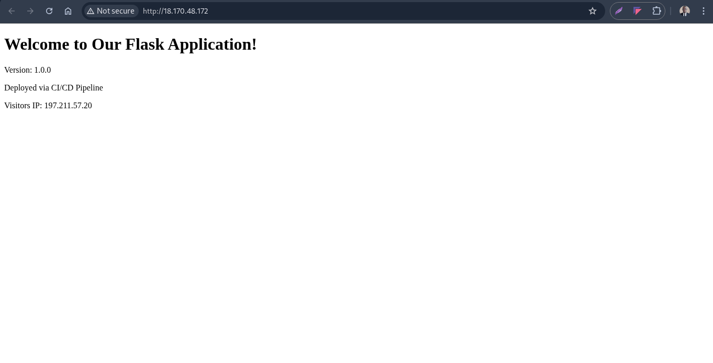
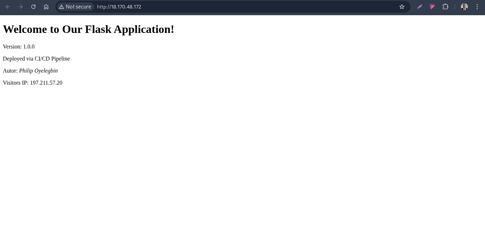
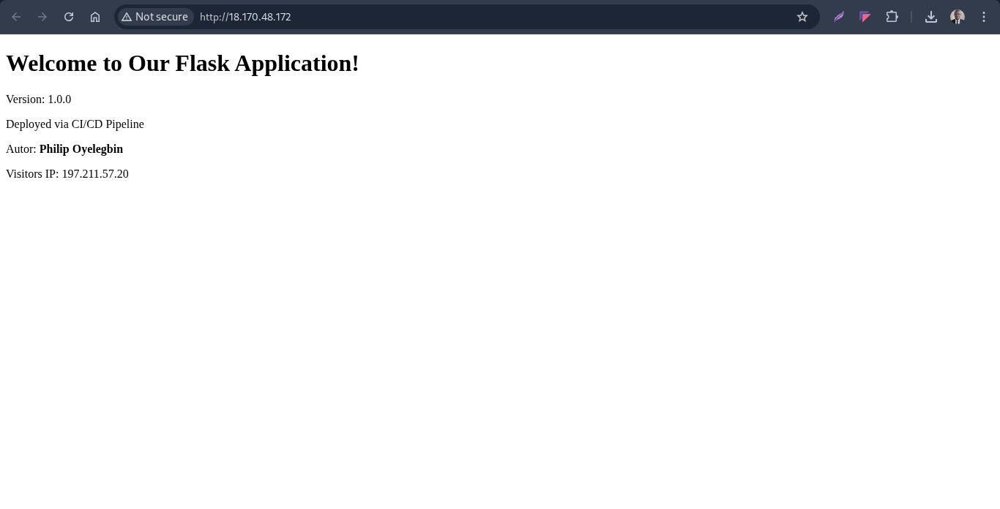

# Flask CI/CD Application - Multi Environment Deployment

## Overview

This project demonstrates a complete CI/CD pipeline for a Python Flask application using GitHub Actions, Docker, and AWS EC2 with multi environment deployment (Staging and Production).

## Architecture

- **Source Control**: GitHub with branch based deployments
- **CI/CD**: GitHub Actions with multi environment workflows
- **Containerization**: Docker with environment specific configurations
- **Infrastructure**: AWS EC2 (Staging + Production instances)
- **Notifications**: Slack with environment specific alerts
- **Deployment Strategy**:
  - Staging: Auto deploy on merge to `staging` branch
  - Production: Auto deploy on merge to `main` branch

## Local Development

```bash
# Setup virtual environment
python -m venv venv
source venv/bin/activate
pip install -r requirements.txt

# Run tests
pytest

# Run locally
flask run
```

## Server Infrastructure Setup

### Step 1: Create EC2 Instances

Create two EC2 instances in AWS:

**Staging Server:**

- Name: `WSS-01`
- Instance Type: t3.small
- Storage: 20GB SSD
- Security Group: `flask-app-staging-sg`

**Production Server:**

- Name: `WSP-01`
- Instance Type: t3.medium
- Storage: 20GB SSD
- Security Group: `flask-app-production-sg`

**Security Group:**

```bash
# Inbound Rules:
- SSH: Port 22
- HTTP: Port 80 (0.0.0.0/0)  # Public access or for testing
- HTTPS: Port 443 (0.0.0.0/0)  # If using SSL
```

### Step 2: Server Setup Script

Run this [setup script](./setup-ec2.sh) on both staging and production servers using the command below:

```bash
# On your local machine
chmod +x setup-ec2.sh
scp -i your-key.pem setup-ec2.sh ubuntu@your-ec2-ip:/tmp/
ssh -i your-key.pem ubuntu@your-ec2-ip "bash /tmp/setup-ec2.sh"
```

---

## Application Structure

```
automated-flaskapp-deployment/
├── app/
│   ├── __init__.py
│   ├── routes.py
│   └── templates/
│       └── index.html
├── assets/     # contains the readme images
├── scripts/
│   └── health-check.sh
├── tests/
│   ├── __init__.py
│   └── test_app.py
├── .github/
│   └── workflows/
│       └── ci-cd.
├── docker-compose.yml
├── Dockerfile
├── requirements.txt
├── .gitignore
├── README.md
└── setup-ec2.sh
```

---

## Configuration Files

- [Dockerfile](./Dockerfile)
- [docker-compose](./docker-compose.yml)
- [CI/CD](.github/workflows/ci-cd.yml)
- [Health check script](./scripts/health-check.sh)

---

## GitHub Secrets Configuration

Navigate to your GitHub repository: Settings → Secrets and variables → Actions

Add the following secrets:

**Required Secrets:**

- `DOCKERHUB_USERNAME`: Your Docker Hub username
- `DOCKERHUB_TOKEN`: Your Docker Hub access token
- `AWS_EC2_USER`: ubuntu (or your EC2 username)
- `AWS_EC2_SSH_KEY`: Private SSH key for EC2 access

**Environment Specific Secrets:**

- `AWS_EC2_STAGING_HOST`: Staging server public IP/DNS
- `AWS_EC2_PRDUCTION_HOST`: Production server public IP/DNS
- `SLACK_WEBHOOK_URL`: Slack webhook URL for notifications

---

## Branch Strategy

```
main        → Production deployments (auto)
staging     → Staging deployments (auto)
feature/*   → Development & testing
hotfix/*    → Emergency fixes
```

---

## Deployment Process

### Staging Deployment (Auto)

1. Push/merge to `staging` branch
2. GitHub Actions runs tests
3. Builds and pushes Docker image
4. Deploys to staging EC2 instance
5. Sends Slack notification


### Production Deployment (Auto)

1. Merge to `main` branch
2. GitHub Actions runs tests
3. Builds and pushes Docker image
4. Deploys to production EC2 instance
5. Sends Slack notification





### Other Deliverables


---

## Manual Operations

### Check Deployment Status

```bash
# Staging
ssh ubuntu@staging-server-ip "cd /opt/app && docker-compose ps"

# Production
ssh ubuntu@production-server-ip "cd /opt/app && docker-compose ps"
```

### View Logs

```bash
# Staging logs
ssh ubuntu@staging-server-ip "cd /opt/app && docker-compose logs"

# Production logs
ssh ubuntu@production-server-ip "cd /opt/app && docker-compose logs"
```

### Manual Health Check

```bash
# Health check production
ssh ubuntu@production-server-ip "cd /opt/app && ./scripts/health-check.sh"
```

## Monitoring & Health Checks

```bash
# Staging Health Check
curl http://staging-server-ip/health

# Production Health Check
curl http://production-server-ip/health
```


**Application URLs:**

- Staging: http://staging-server-ip
- Production: http://production-server-ip

---

## Troubleshooting

### Common Issues:

1. **Deployment Fails:**

   - Check GitHub Actions logs
   - Verify SSH keys and secrets
   - Check server disk space

2. **Container Won't Start:**

   - Check Docker logs: `docker-compose logs`
   - Check port availability

3. **Health Check Fails:**
   - Verify application is running
   - Check firewall settings
   - Review application logs

### Support:

- Check GitHub Actions run history
- Review server logs in `/var/log/`
- Monitor Slack notifications for deployment status

---

## Conclusion

This multi environment setup provides a robust CI/CD pipeline with clear separation between staging and production, ensuring safe and reliable deployments.
